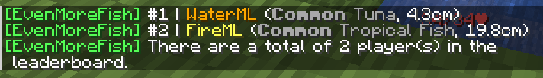

## What are they?
There are 7 different competition types in EvenMoreFish for your players to experience, all listed on this page. Each competition you choose must define a competition type for it to work.

## LARGEST_FISH
As the title would suggest, the player with the largest fish caught will win the competition, and the player with the second largest fish will come second (and so on), by using `/emf top` your players will be able to view the current leaderboard - requiring they have the `emf.top` permission node.

## MOST_FISH
In this competition, your players will be ranked in the leaderboard by the number of fish they catch. This type is likely to be biased by the "Lure" enchant which naturally causes players to catch more fish - however your players will also be very close to each other in the competition and won't be able to just fish 1 legendary and walk away, leading to (hopefully) a very intense competition, you may want to set the `new-first` message in `messages.yml` to be a bossbar message, otherwise it could lead to spam in the chat as the competition begins and players are all catching fish.

## SPECIFIC_FISH
This competition type selects a fish at random from the list of `allowed-rarities` you give it, if it's started by command, the allowed rarities are chosen from the value in the general section. By default, only 1 of the selected fish is needed to win the competition, therefore /emf top is disabled for this event however you can set the number of the fish needed to a different value to increase the difficulty, allowing the leaderboard to be enabled in a similar style to the MOST_FISH competition type. Please keep in mind that setting this to multiple fish needed of a rare rarity could result in a competition rarely getting winners, as the competition still ends after the set timer regardless of whether the specific fish was caught or not.

## SPECIFIC_RARITY
This competition type selects a rarity at random from the list of `allowed-rarities` you give it, if it's started by command, the allowed rarities are chosen from the value in the general section. By default, only 1 fish with its rarity as the selected rarity is needed to win the competition, therefore /emf top is disabled for this event however you can set the number of the fish needed to a different value to increase the difficulty, allowing the leaderboard to be enabled in a similar style to the MOST_FISH competition type. Please keep in mind that setting this to contain rare rarities could result in a competition rarely getting winners, as the competition still ends after the set timer regardless of whether the specific rarity was caught or not.

## LARGEST_TOTAL
When a player catches a fish, their score is increased by the size of their fish, allowing players to gradually increase their score cumulatively. At the end of the competition, the player with the highest total score will win, similar to all other competitions - it's similar to the MOST_FISH competition in that the %emf_competition_place_fish_*% placeholder will not work.

## SHORTEST_TOTAL
Almost identical to LARGEST_TOTAL, however the lowest total score wins.

## SHORTEST_FISH
Almost identical to LARGEST_FISH, however the smallest fish wins.

